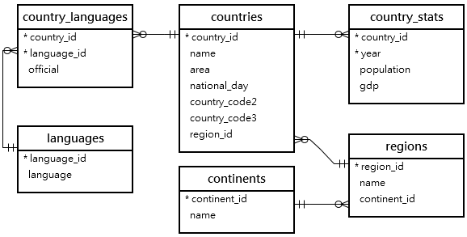
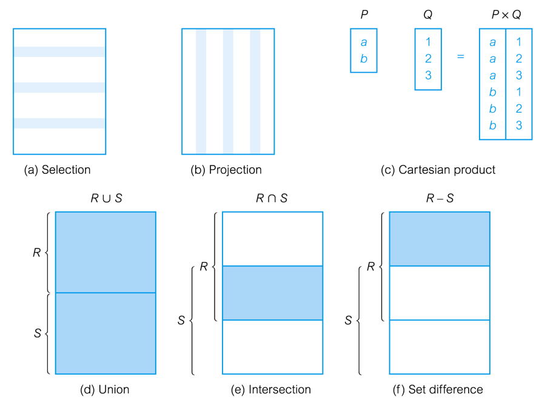

# SQL SELECT statements


## Sample Database – Nations
Follow [these instructions](https://www.mariadbtutorial.com/getting-started/mariadb-sample-database/) to install the sample database.
   

 


### Getting Information about the Database
- To see the tables in a database use `SHOW TABLES;`
- To see the columns in a table
`SHOW COLUMNS FROM table_name`
  - Example: `SHOW COLUMNS FROM countries;`

## Basic `SELECT` statements

### Retrieving data
- Use the select statement
  - This is the most commonly used SQL statement
- Has 6 main clauses
  - `SELECT`	Specifies which columns are to appear in output.
  - `FROM`	Specifies table(s) to be used.
  - `WHERE` 	Filters rows.
  - `GROUP` BY	Forms groups of rows with same column value.
  - `HAVING`	Filters groups subject to some condition.
  - `ORDER` BY 	Specifies the order of the output.

### `SELECT` Statement
- Order of the clauses cannot be changed.
- Only `SELECT` and `FROM` are mandatory.

### Basic `SELECT` statement
- `SELECT field1, field2 FROM table;`
- Example:

```sql
SELECT continent_id, name
FROM continents;
```
- Use * to select all fields
```
SELECT *
FROM continents;
```
- Only use `*` when you need to retrieve all columns from a table.  

### Selecting Specific Columns, All Rows
Produce a list of  all employees, showing only  employee  number, first name and last name.

```sql
SELECT country_id, name, area 
FROM countries;

```

### :question: SELECT – Exercises
- Select the country name, national day  and region id from the countries table
- Select all fields from the regions table
- Select the name and continent id for all regions


### Calculated Values
- You can use arithmetic in `SELECT` statements
- Operators
  -Multiplication: `*`
  - Division: `/`
  - Integer division: `DIV`
  - Modulo (remainder): `%` or `MOD` - Addition: `+`
  Subtraction: `-`
- Precedence
  - Multiplication, division, modulo
  - Addition, Subtraction
  - Can control using parenthesis

  ### Example: Calculated Fields
  Produce list of countries and area in square miles.  The ratio  from square mile to square kilometer is 0.386102.


```sql
SELECT name, area * 0.386102
FROM countries;
  ```

### Defining a Column Alias
- Renames a column heading in the result set
- Is useful with calculations
- Immediately follows the column name - there can also be the optional `AS` keyword between the column name and alias - Requires double quotation marks if it contains spaces or special characters or is case sensitive

### Example: Calculated Fields with Alias
```
SELECT emp_no, salary/12 AS monthlySalary 
SELECT name, area * 0.386102 as square_miles 
FROM countries
LIMIT 10;
```


### Removing Duplicate Rows
- List the region ids used in the countries table.

``` sql
SELECT region_id
FROM countries;
```

### Use of `DISTINCT`
Use `DISTINCT` to eliminate duplicates:
```sql
SELECT DISTINCT region_id
FROM countries;

 ```

## Relational Algebra

### Introduction
- Relational algebra and relational calculus are formal languages associated with the relational model.
- Informally, relational algebra is a (high-level) procedural language and relational calculus a non-procedural language.
- However, formally both are equivalent to one another.
- A language that produces a relation that can be derived using relational calculus is relationally complete.

### Relational Algebra
- Relational algebra operations work on one or more relations to define another relation without changing the original relations.
- Both operands and results are relations, so output from one operation can become input to another operation.
- Allows expressions to be nested, just as in arithmetic. This property is called **closure**.

### Operations
- Five basic operations in relational algebra: Selection, Projection, Cartesian product, Union,  and Set Difference.
- These perform most of the data retrieval operations needed.
- Also have Join, Intersection, and Division operations, which can be expressed in terms of 5 basic operations.

### Relational Algebra Operations


### Projection
- Works on a single relation R and defines a relation that contains a vertical subset of R, extracting the values of specified attributes and eliminating duplicates.

### Relational Algebra: Selection (or Restriction)
- 𝜎(𝑅)
- Works on a single relation R and defines a relation that contains only those tuples (rows) of R that satisfy the specified condition (predicate).
