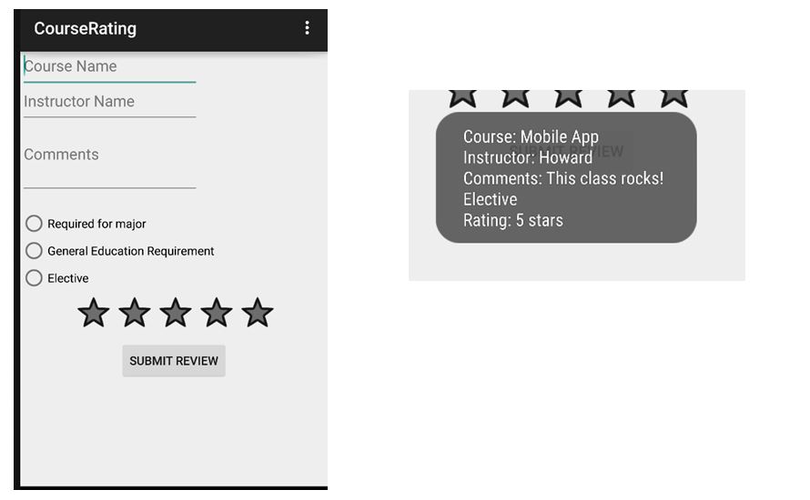

# Rating App Assignment

For this assignment you will create your own application that collects rating or survey data for something **other than course ratings** (books, movies, restaurants, video games,  etc.).

### Requirements for this assignment:
- There is a model class for your rating or survey response.  
  -  The model class contains values such as strings, floats and integers, **NOT widgets**.
- Activity class contains an instance of the model class.
- Activity class contains at least 3 widgets with listeners that update the model object.
- At least one of these controls is one that was  **not covered in lecture**, such as checkboxes or radio buttons.
- The user interface is well designed, using margins, paddings and size attributes to make the application easy to read and use.
- In addition to the 3 widgets, the Activity contains a button that displays the values stored in the model object.

### Grading

This assignment is worth **20 points**

Your assignment will be evaluated based on the following rubric:
- Rating/survey layout contains at least three components: 3 pts.
- At least one "new" component: 2 pts.
- Rating/survey layout is well designed: 2 pts.
- Application uses string resources: 2 pts.
- All components have useful IDs: 2 pts.
- Model class contains appropriate attributes, a constructor, getters, setters and a `toString` class: 3 pts.
- Listeners update model object: 3 pts.
- Toast appears when button is pressed and contains a summary of the model object formatted in a legible manner : 3 pts.
