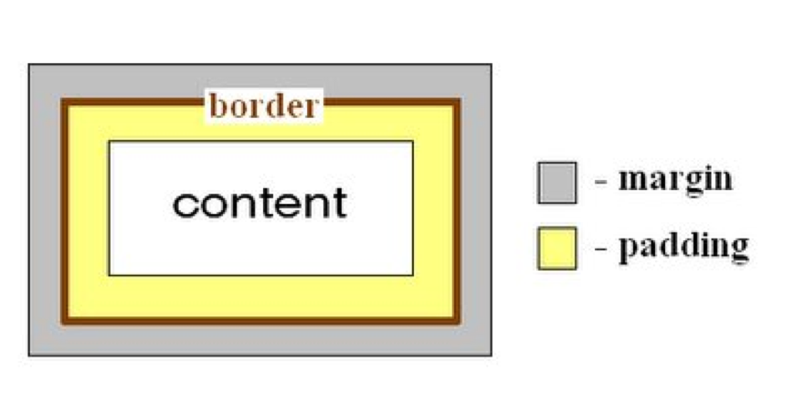

# User Interface Overview

## View
- Represents a space on the screen
- Is responsible for drawing and event handling
- Base class for widgets and layouts

## Widgets
- Widgets are used to create interactive UI components
- Android provides many widgets in the [`android.widget package`](http://developer.android.com/reference/android/widget/package-summary.html)

## Layouts
- Layouts are containers for other views or widgets
- Define how the widgets are arranged on the screen
- XML or Java Code

## XML Layouts
- XML vocabulary matches structure and names of Java classes
- "Inflate the layout" using the `setContentView()` in the `onCreate()` method of your activity
- Each Layout has one root element

## What is XML?
- XML is a markup language used to describe the layout of any kind of information
- XML consists of
  - Elements - pairs of tags with optional content between tags
    - Content inside of tags can be other elements or text
    - Every XML document defines a single root element
  - Attributes - provide additional information for an element
  - Key value pairs nested inside opening tag
- Example: `<string name="app_name">ViewTester</string>`
  - `<string>` is an element
  - `name` is an attribute

## ID
- All View elements should have an ID
- Defined using the `android:id attribute`
  - Example:  `android:id="@+id/my_button"`
- To reference a View, declare an instance of the View object and then capture it from the layout using the `findViewById()` method reference the ID as these argument

## Size
- Each view is required to define a width (`layout_width`) and a height (`layout_height`)
- Value options
  - `wrap_content`
  - `match_parent`
  - Exact dimensions

## Measurement Units
- `px` – pixel
- `dp` – density-independent pixel
preferred
- `sp` – scale independent pixels
Use for textSize

## Margins and Padding

- A view has margin and padding
- Example: `android:layout_marginTop="10dp" android:paddingTop="10dp"`

## Gravity
- Specifies how a view arranges its content horizontally and vertically
- Example: `android:gravity="center_vertical|center_horizontal"`

## LinearLayout
http://developer.android.com/reference/android/widget/LinearLayout.html
- Arrange components horizontally in one row or vertically in one column
- Important attributes
  - orientation
  - gravity
  - weightSum

## Color
- Colors are defined in `values/colors.xml`
- You can  make changes by the theme
    - Note there is also a dark theme
- Color Resources
  - [Material Design Color](https://material.io/design/color/the-color-system.html#color-usage-and-palettes)
  - [Color Tool](https://material.io/resources/color/#!/?view.left=0&view.right=0&primary.color=6002ee)
